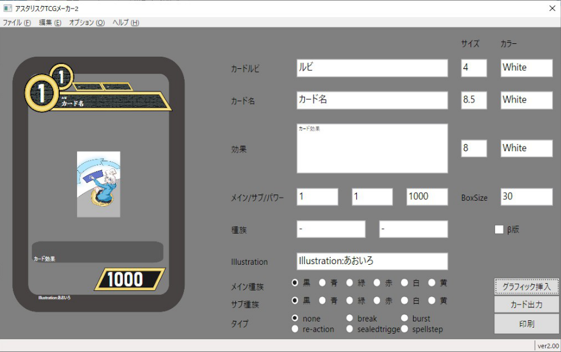

# AsteriskTCGMaker

## 更新履歴
### 2020/7/20 ver3.00β3を公開（大型アップデート）
 - プロジェクト管理機能を実装
 - 正確にデザインを統一
 - サムネイル画像の保存処理を実装
 - Wiki形式からの入出力に対応
 - フォントサイズを小数点単位で変更できるように修正
 - リアルタイム文字列プレビュー時に他のユーザーと競合するとデータが破損する問題を修正
 - ファイル保存先を色ごとに分類する機能を実装
 - 文字サイズ調整をマウスで操作しやすいように変更
 - 画像出力後に失敗するパターンを1通り解消
 - アイコン素材を追加
 - 各数字欄に数字以外が入力できなかった問題を修正
 - 各進行状況をステータスバーに通知する機能を実装
 - アプリが落ちる場合、主要なパターンでは落ちる代わりに問題を通知するように修正
 - UIを使いやすいように改良
 - 英語表記をカタカナに修正
 
 
### 2019/8/31 ver2.29を公開
 - iLLustration・β版表記の位置を変更
 - サブマナの字の色を変更できる機能を実装
 - フレーバーテキストと効果テキストのフォントサイズを個別指定できる機能を実装
 - 効果テキストとフレーバーテキストの間にギャップを追加
 - アイコンの追加
 - スペルに置いてbreakアイコンがきえるように修正
 - ルビの位置を修正
 - 背景を出力しないように修正

### 2019/8/25 ver2.20を公開
 - スペルにおいて画面レイアウトが変わるように修正
 - レイアウト修正
 
### 2019/8/24 ver2.10を公開
 - アイコンの位置を修正
 - 表記の種族を色に変更
 - ステラ・スペラをラジオボタンで切り替えできるように変更
 - カード裏面の印刷機能を実装
 - 画像出力機能を実装
 - イラスト挿入サイズを定義
 - テキストボックスのサイズを大きくすると端部が歪になる問題を修正
 - 文字内アイコンを実装
 
### 2019/8/21 ver2.00を公開（大型アップデート）
 - 動作を高速化
 - 印刷機能を追加
 - 種族を2つ入力できる機能を実装
 - ルビを正確に入力できる機能を実装
 - サブ色を実装
 - フレーム位置を修正
 - フォントを実際のものに統一
 - 効果についてもフォントサイズを変えられるように修正
 - タイプの設定機能を追加
 - β版かどうか選択できる機能を追加
 - テキストボックスのサイズが可変になるよう修正
 

### 2019/4/6以前 ver1.00を公開

